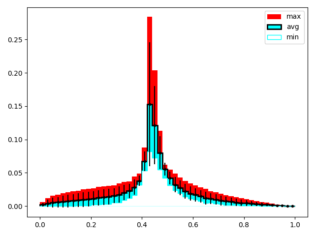

> "Mankind invented a system to cope with the fact that we are so intrinsically lousy at manipulating numbers. It's called the graph." - [Charlie Munger](https://en.wikipedia.org/wiki/Charlie_Munger)

> "...You might think that, data presentation being almost the primary reason for ROOT's existence, it might be good at it. Well, for some reason the default plot style is unfeasibly ugly (grey background?!) and difficult to fix. In fact to fix it you have to go via several global ROOT objects. Gah." - [Andy Buckley](https://www.ppe.gla.ac.uk/~abuckley/)

## Objectives

* Briefly introduce matplotlib
* Talk about histogramming
  * How does one scale a histogram?
* Talk even more about histogramming
* _Emphasize_ histograms even more

***

## Producing Plots Pythonically

Much of science is nothing without pretty plots! These satisfying pieces of data are able to show distributions in a nice way that our brains can comprehend. Showing a plots like below is a much better way of showing the range over a bunch of different samples than writing the range and standard deviations in a table.



Luckily, (unlike CERN ROOT), it is very easy to plot in Python. It's as simple as:

```python
import matplotlib.pyplot as plt
import numpy as np
x = 
y = 
```